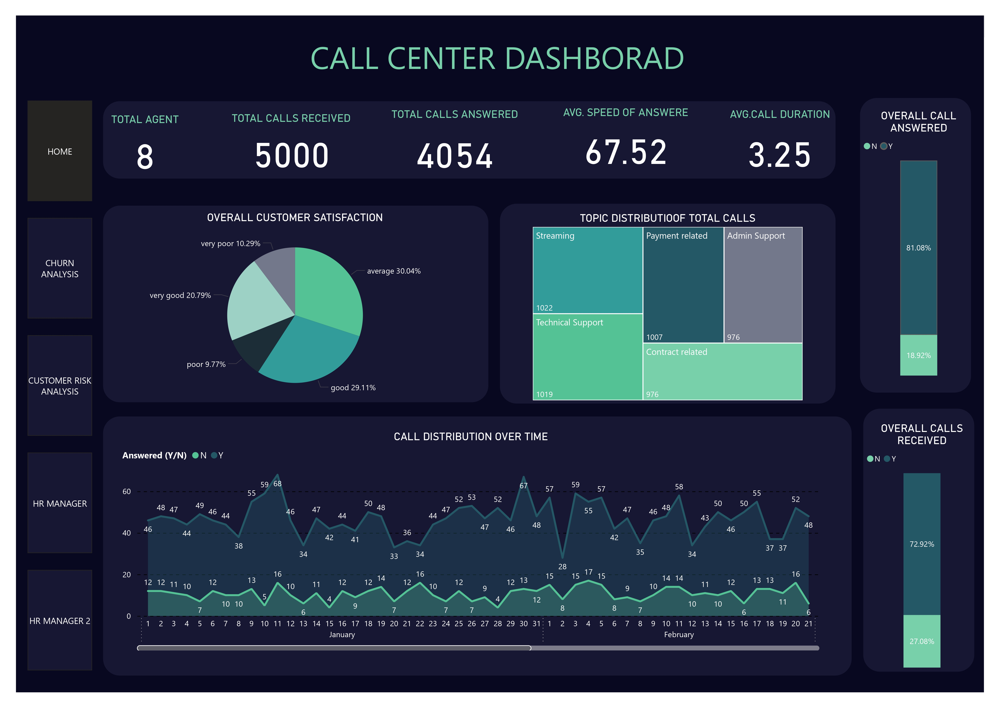
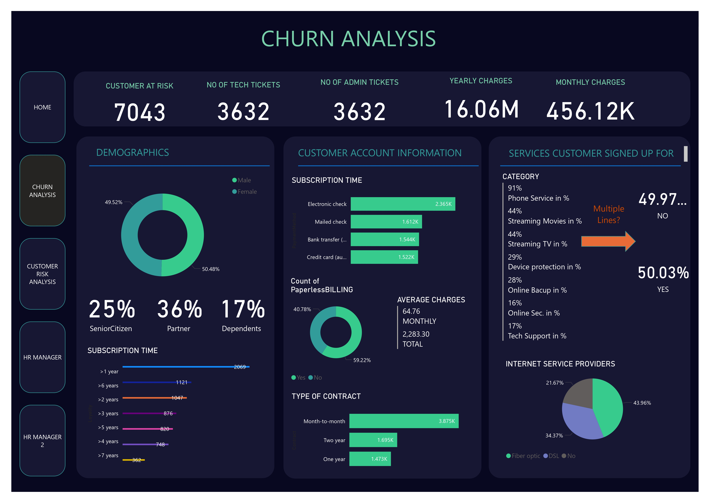
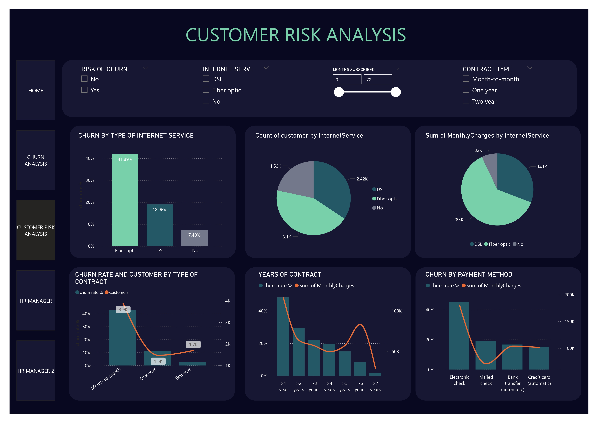
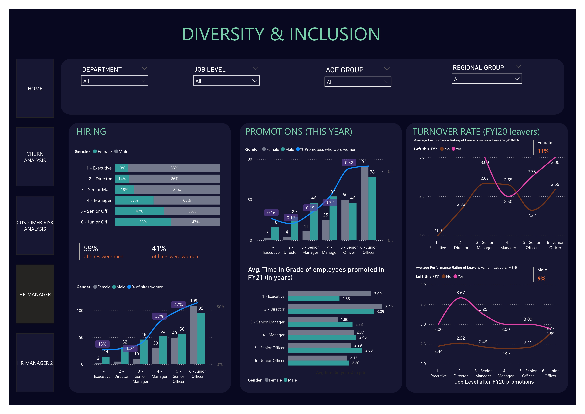
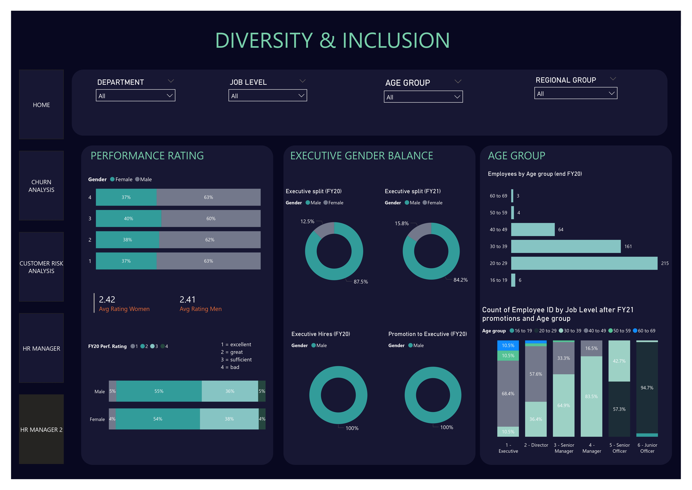

# Pwc-call-center-forage
---
## 1. Problem Statement:

   Hi Digital Accelerator,
      May I introduce myself? I'm Claire, Call Centre Manager here at PhoneNow. My colleague suggested I reach out to you. Pleased to meet
      you.
      I'm looking for transparency and insight into the data we have here at the Call Centre. For example: total number of calls answered and
      abandoned, speed of answer, length of calls, overall customer satisfaction, etc. What I'm after is an accurate overview of long-term
      trends in customer and agent behaviour.
      I was told you are great at visualising data in such a way that important aspects become very clear. Thats precisely what I need.
      Could you please prepare a dashboard on Call Centre trends that I can use as a basis for discussion with management? I'll provide you
      with the required data, of course.
      Looking forward to hearing from you.
    Best regards,
    Claire

## 🎯 Task 1:
      Create a dashboard in Power Bl for Claire that reflects all relevant Key Performance Indicators
      (KPIs) and metrics in the dataset. Get creative!
      Possible KPIs include (to get you started, but not limited to):
      1. Overall customer satisfaction
      2. Overall calls answered/abandoned
      3. Calls by time
      4. Average speed of answer
      5. Agent's performance quadrant -> average handle time (talk duration) vs calls answered

## 🚀 Output:

## 🎯 Task 2:   
  1. Define proper KPIs
  2. Create a dashboard for the retention manager reflecting the KPIs
  3. Write a short email to him (the engagement partner) explaining your findings, and include    
     suggestions as to what needs to be changed

## 🚀 Output:
**Email**
     
      Niraj Mewada
      Subject: Update on Project Progress
   
      Dear Claire,

      I hope this email finds you well. I wanted to provide you with a brief update on the progress of our current project.
   
      Over the past few weeks, the team has been diligently working on this churn data for finding out insights. We've encountered some key insights, and I believe it's important 
      for  you to be informed about our efforts to address them.
   
      1) Increase tech support capacity for Fiber Optic customers and lower tech tickets per customer to 0.5
      2) Increase sale of 1 and 2 year contracts by 5% each
      3) Yearly increase of automatic payments by 5%
      
      As we move forward, we are focused on increasing the key performance indicators and ensuring that we stay on track with the project timeline. If you have any specific 
      preferences or areas of concern, you'd like us to prioritize, please feel free to let me know.
      
      Additionally, we are open to scheduling a brief meeting at your convenience to discuss the project in more detail or address any questions or feedback you may have.
      
      Thank you for your continued support, and I look forward to hearing from you.

      Best Regards,
      Niraj Mewada

## 🎯 Task 3:
   1. Define relevant KPIs in hiring, promotion, performance and turnover, and create a visualisation
   2. Write what you think some root causes of their slow progress might be

        ## Measures :
               No of men
               No of women
               No of leavers
               % employees promoted (FY21)
               % of women promoted
               % of hires men
               % of hires women
               % turnover 
               Average performance rating: men
               Average Performance rating: women
      
## 🚀 Output:

